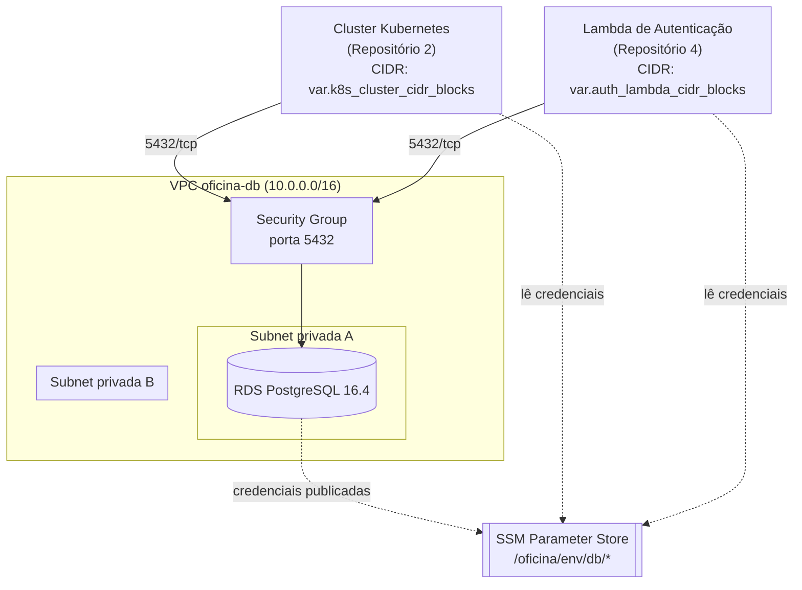

# oficina-db-infrastructure

Infraestrutura como código (Terraform) para provisionamento do banco de dados
gerenciado **AWS RDS PostgreSQL** do projeto **oficina**. Este é o **Repositório 1**
da Fase 3 do Tech Challenge, dentro da arquitetura de 4 repositórios independentes:

| # | Repositório | Responsabilidade |
|---|---|---|
| 1 | **oficina-db-infrastructure** (este) | Banco de dados gerenciado (RDS PostgreSQL) |
| 2 | oficina-k8s-infrastructure | Cluster Kubernetes (compute) na nuvem |
| 3 | oficina-app | Aplicação NestJS (Clean Architecture/DDD) |
| 4 | oficina-auth-lambda | Lambda de autenticação |

## Sumário

- [Propósito](#propósito)
- [Tecnologias](#tecnologias)
- [Arquitetura](#arquitetura)
- [Recursos provisionados](#recursos-provisionados)
- [Segurança](#segurança)
- [Pré-requisitos](#pré-requisitos)
- [Bootstrap do backend remoto](#bootstrap-do-backend-remoto)
- [Execução local](#execução-local)
- [Execução via CI/CD](#execução-via-cicd)
- [Outputs](#outputs)
- [Variáveis](#variáveis)

## Propósito

Provisionar, de forma declarativa e reprodutível, uma instância PostgreSQL
gerenciada (Amazon RDS) isolada em uma VPC dedicada, acessível **apenas** pelas
subnets do cluster Kubernetes (Repositório 2) e da Lambda de autenticação
(Repositório 4). As credenciais de conexão são publicadas no AWS Systems Manager
Parameter Store (SecureString), eliminando a necessidade de distribuir a senha
em texto puro entre os demais repositórios, sem o custo fixo do Secrets Manager.

## Tecnologias

| Ferramenta | Versão |
|---|---|
| Terraform | >= 1.6.0 |
| Provider `hashicorp/aws` | ~> 5.0 |
| Provider `hashicorp/random` | ~> 3.6 |
| Amazon RDS | PostgreSQL 16.4 |

## Arquitetura



## Recursos provisionados

| Recurso | Descrição |
|---|---|
| `aws_vpc.this` | VPC dedicada à infraestrutura de banco de dados |
| `aws_subnet.private[*]` | Subnets privadas (uma por AZ) sem IP público |
| `aws_db_subnet_group.this` | Subnet group usado pelo RDS |
| `aws_security_group.rds` + regras | Acesso restrito à porta 5432 apenas para CIDRs do K8s e da Lambda |
| `aws_db_parameter_group.this` | Parâmetros do PostgreSQL (SSL obrigatório, log de conexões) |
| `aws_db_instance.this` | Instância RDS PostgreSQL com backup automático e storage criptografado |
| `aws_ssm_parameter.*` | Credenciais de conexão publicadas no SSM Parameter Store (SecureString) |

## Segurança

- **Nenhuma credencial em texto puro**: `db_master_password` não possui valor
  default e não deve constar em `.tfvars`. É fornecida via `TF_VAR_db_master_password`
  (execução local) ou GitHub Secrets (`DB_MASTER_PASSWORD`, no CI/CD).
- **Sem exposição pública**: `publicly_accessible = false`; a instância vive
  exclusivamente em subnets privadas.
- **Sem `0.0.0.0/0` em regras de entrada**: o Security Group libera a porta 5432
  somente para os CIDRs do cluster Kubernetes e da Lambda de autenticação,
  parametrizados via `k8s_cluster_cidr_blocks` e `auth_lambda_cidr_blocks`.
- **Storage e conexão criptografados**: `storage_encrypted = true` e
  `rds.force_ssl = 1` no Parameter Group.
- **SSM Parameter Store**: outras aplicações devem buscar a credencial em runtime
  no Parameter Store (ex: via External Secrets Operator no Kubernetes, ou SDK da
  AWS na Lambda), em vez de recebê-la propagada em variáveis de ambiente estáticas.
  Optamos por Parameter Store (SecureString) em vez de Secrets Manager para evitar
  o custo fixo por segredo, que não é coberto pelo free tier.
- **State remoto com lock**: backend `s3` + `dynamodb_table` evita corrupção de
  state por execuções concorrentes.

## Pré-requisitos

- [Terraform](https://developer.hashicorp.com/terraform/downloads) >= 1.6.0
- Conta AWS com credenciais configuradas (`aws configure` ou variáveis de ambiente)
- Permissões IAM para criar VPC, RDS, Security Groups e parâmetros SSM
- Bucket S3 e tabela DynamoDB do backend remoto já criados (ver seção abaixo)

## Bootstrap do backend remoto

O backend `s3`/`dynamodb` referenciado em [`backend.tf`](backend.tf) precisa
existir **antes** do primeiro `terraform init`. Crie-o uma única vez:

```bash
aws s3api create-bucket \
  --bucket <NOME_DO_BUCKET> \
  --region us-east-1

aws s3api put-bucket-versioning \
  --bucket <NOME_DO_BUCKET> \
  --versioning-configuration Status=Enabled

aws dynamodb create-table \
  --table-name oficina-db-terraform-locks \
  --attribute-definitions AttributeName=LockID,AttributeType=S \
  --key-schema AttributeName=LockID,KeyType=HASH \
  --billing-mode PAY_PER_REQUEST \
  --region us-east-1
```

## Execução local

```bash
# 1. Configure a senha master (NUNCA em arquivo versionado)
export TF_VAR_db_master_password="<senha-forte>"

# 2. Copie e ajuste as variáveis não sensíveis
cp terraform.tfvars.example terraform.tfvars

# 3. Inicialize apontando para o backend remoto criado no bootstrap
terraform init \
  -backend-config="bucket=<NOME_DO_BUCKET>" \
  -backend-config="region=us-east-1" \
  -backend-config="dynamodb_table=oficina-db-terraform-locks"

# 4. Revise o plano
terraform plan

# 5. Aplique
terraform apply
```

## Execução via CI/CD

Pipeline definida em [`.github/workflows/terraform-db.yml`](.github/workflows/terraform-db.yml):

1. **lint-validate** (sempre): `terraform fmt -check`, `terraform validate`,
   scans de segurança com `tfsec` e `checkov`.
2. **plan** (em Pull Requests): gera o plano e comenta o resultado no PR.
3. **apply** (somente em push na `main`): aplica automaticamente as mudanças.

### Configuração necessária no GitHub

Antes de usar a pipeline, configure em **Settings**:

- **Secrets**: `AWS_ROLE_ARN`, `TF_STATE_BUCKET`, `TF_STATE_LOCK_TABLE`, `DB_MASTER_PASSWORD`
- **Variables**: `TF_ENVIRONMENT` (ex: `production`)
- **Branch protection na `main`**: exigir Pull Request para merge, exigir que os
  checks `lint-validate` e `plan` passem antes do merge, e proibir push direto.
- **Environment `production`** com *required reviewers*, para exigir aprovação
  manual antes do job `apply` rodar.

## Outputs

| Output | Descrição |
|---|---|
| `db_instance_endpoint` | Endpoint (host:porta) do RDS |
| `db_instance_address` | Hostname do RDS |
| `db_instance_port` | Porta de conexão |
| `db_subnet_group_name` | Nome do DB Subnet Group |
| `rds_security_group_id` | ID do Security Group do RDS |
| `vpc_id` | ID da VPC criada |
| `ssm_parameter_prefix` | Prefixo dos parâmetros no SSM Parameter Store com as credenciais |

## Variáveis

Consulte [`variables.tf`](variables.tf) para a lista completa, com descrições,
tipos e defaults. As mais relevantes para ajustar por ambiente:

| Variável | Default | Observação |
|---|---|---|
| `aws_region` | `us-east-1` | |
| `environment` | `production` | Afeta `deletion_protection` e `skip_final_snapshot` |
| `vpc_cidr` | `10.0.0.0/16` | |
| `k8s_cluster_cidr_blocks` | `10.1.0.0/16` | Placeholder — ajustar ao integrar com o Repositório 2 |
| `auth_lambda_cidr_blocks` | `10.2.0.0/16` | Placeholder — ajustar ao integrar com o Repositório 4 |
| `db_master_password` | — (obrigatório) | Somente via `TF_VAR_db_master_password` |
| `multi_az` | `false` | Recomendado `true` em produção real |
